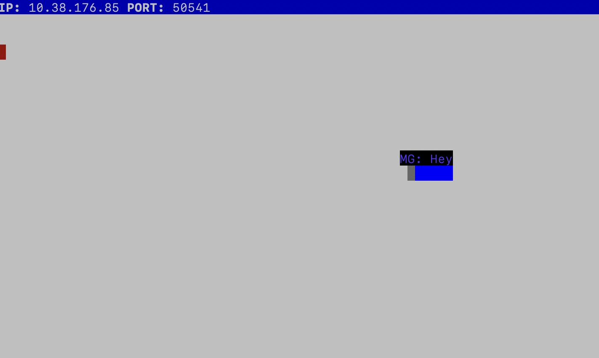

# Snake Client Project

The classic Snake game! Steer the snake towards the dot to "eat it" and grow bigger. Don't run into the sides or yourself! Grow as big as possible to win.

Before you can run this client, you will need to be running the server side which you can download and install from the link below. 

## Final Product

## Getting Started

- Follow steps inside the [snek server repo](https://github.com/lighthouse-labs/snek-multiplayer) to run the server side
- Run the development snake client using the `node play.js` command.

## Playing the game

- Press 'wasd' to move
- W for up
- A for left
- S for down
- D for right
- Press Z, X, or C to make the snake say a message
- Have fun!
